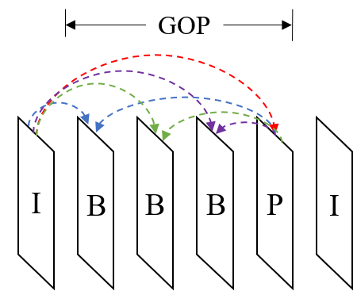

GOP
---

The codecs supports common group of pictures (GOP), 
specifying its size, frame types and relative positions inside, and delta QP for each frame.

.. table::
      :align: left
      :widths: auto

      ============ ======================= ====== =========== ======== =============== =============== =========== ================================================================================================================================================================================================================================================================================================================================= ========================================================================================== 
       domain       name                    size   short key   type     minimum value   maximum value   precision   default value                                                                                                                                                                                                                                                                                                                     description
      ============ ======================= ====== =========== ======== =============== =============== =========== ================================================================================================================================================================================================================================================================================================================================= ==========================================================================================
      gop          gopSiz                  1      /           int      1               32              /           1                                                                                                                                                                                                                                                                                                                                 size of gop
      gop          gopEnmTyp               32     /           int      0               2               /           1 0 0 0 0 0 0 0 0 0 0 0 0 0 0 0 0 0 0 0 0 0 0 0 0 0 0 0 0 0 0 0                                                                                                                                                                                                                                                                   frame types in one gop (<value> 0: I; 1: P; 2: B)
      gop          gopDatPoc               32     /           int      0               /               /           1 0 0 0 0 0 0 0 0 0 0 0 0 0 0 0 0 0 0 0 0 0 0 0 0 0 0 0 0 0 0 0                                                                                                                                                                                                                                                                   picture order counter in one gop
      gop          gopDatQpDlt             32     /           int      -51             51              /           0 0 0 0 0 0 0 0 0 0 0 0 0 0 0 0 0 0 0 0 0 0 0 0 0 0 0 0 0 0 0 0                                                                                                                                                                                                                                                                   delta QP in one gop
      gop          gopFlgRefNeg            32     /           bool     /               /               /           1 0 0 0 0 0 0 0 0 0 0 0 0 0 0 0 0 0 0 0 0 0 0 0 0 0 0 0 0 0 0 0                                                                                                                                                                                                                                                                   enable flags for negative references in one gop
      gop          gopFlgRefPos            32     /           bool     /               /               /           0 0 0 0 0 0 0 0 0 0 0 0 0 0 0 0 0 0 0 0 0 0 0 0 0 0 0 0 0 0 0 0                                                                                                                                                                                                                                                                   enable flags for positive references in one gop
      gop          gopNumRefPos            32     /           int      0               5               /           0 0 0 0 0 0 0 0 0 0 0 0 0 0 0 0 0 0 0 0 0 0 0 0 0 0 0 0 0 0 0 0                                                                                                                                                                                                                                                                   number of positive references in one gop (the number of negative references is fixed: 1)
      gop          gopDatPocRefDltNeg      32     /           int      /               /               /           -1 0 0 0 0 0 0 0 0 0 0 0 0 0 0 0 0 0 0 0 0 0 0 0 0 0 0 0 0 0 0 0                                                                                                                                                                                                                                                                  delta POC of negative references in one gop
      gop          gopDatPocRefDltPos      32x5   /           int      /               /               /           0 0 0 0 0 0 0 0 0 0 0 0 0 0 0 0 0 0 0 0 0 0 0 0 0 0 0 0 0 0 0 0 0 0 0 0 0 0 0 0 0 0 0 0 0 0 0 0 0 0 0 0 0 0 0 0 0 0 0 0 0 0 0 0 0 0 0 0 0 0 0 0 0 0 0 0 0 0 0 0 0 0 0 0 0 0 0 0 0 0 0 0 0 0 0 0 0 0 0 0 0 0 0 0 0 0 0 0 0 0 0 0 0 0 0 0 0 0 0 0 0 0 0 0 0 0 0 0 0 0 0 0 0 0 0 0 0 0 0 0 0 0 0 0 0 0 0 0 0 0 0 0 0 0 0 0 0 0 0 0   delta POC of positive references in one gop
      ============ ======================= ====== =========== ======== =============== =============== =========== ================================================================================================================================================================================================================================================================================================================================= ========================================================================================== 