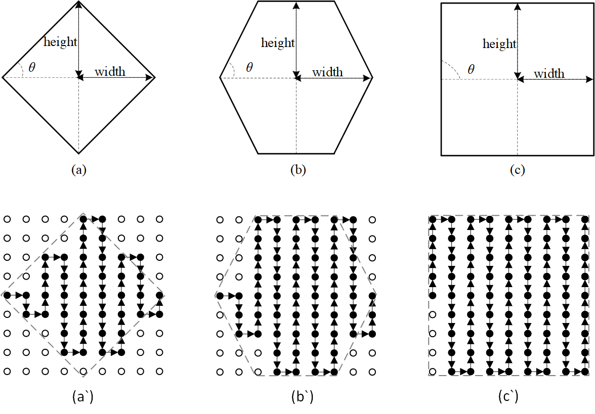

IME
---

The codec supports integer motion estimation (IME), 
and the best integer motion vector inside the specified 
search pattern is achieved based on the SAD cost and MVD cost.

Examples for search pattern are shown below, 
where their ``imeSizPtnX`` (width) and ``imeSizPtnY`` (height) are 5 
while their ``imeEnmSlp`` (tanθ) are 1, 2, infinite, respectively. 

.. table::
   :align: left
   :widths: auto

   .. include:: ime_sub.rst
