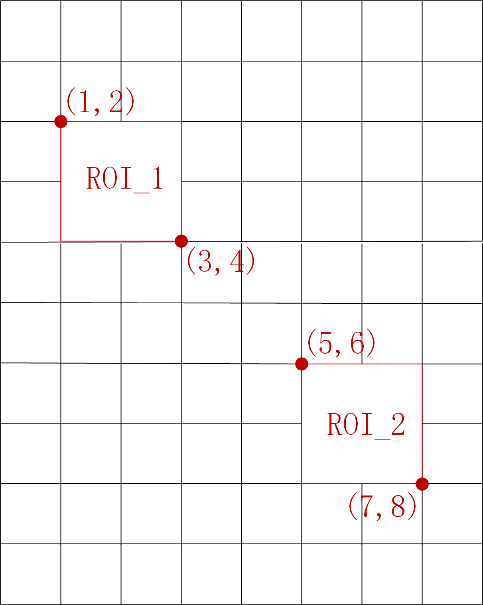

ROI
---

The codec supports region of interest (ROI) interface, 
specifying at most two areas per frame in the unit of LCU, 
and setting the blocks type and QP for those areas.

Users can use preprocessing algorithms to select ROI 
according to different application scenarios.

Example of ROI with default settings is shown below.

.. table::
      :align: left
      :widths: auto

      ============ ======================= ====== =========== ======== =============== =============== =========== ==================================== ========================================================================= 
       domain       name                    size   short key   type     minimum value   maximum value   precision   default value                       description
      ============ ======================= ====== =========== ======== =============== =============== =========== ==================================== =========================================================================
      roi          roiIdxLcuBgnX           2      /           int      0               127             /           1 5                                  index of ROI's begin LCU in the X (horizontal) direction
      roi          roiIdxLcuBgnY           2      /           int      0               127             /           2 6                                  index of ROI's begin LCU in the Y (vertical)   direction
      roi          roiIdxLcuEndX           2      /           int      0               127             /           3 7                                  index of ROI's begin LCU in the X (horizontal) direction
      roi          roiIdxLcuEndY           2      /           int      0               127             /           4 8                                  index of ROI's begin LCU in the Y (vertical)   direction
      roi          roiFlgTyp               2      /           bool     /               /               /           0 0                                  enable flag for block types of ROI
      roi          roiEnmTyp               2      /           int      0               2               /           0 2                                  block types of ROI (<value> 0: intra; 1: inter; 2: skip)
      roi          roiFlgQp                2      /           bool     /               /               /           0 0                                  enable flag for QP of ROI
      roi          roiDatQp                2      /           int      0               51              /           22 37                                QP value of ROI
      ============ ======================= ====== =========== ======== =============== =============== =========== ==================================== ========================================================================= 